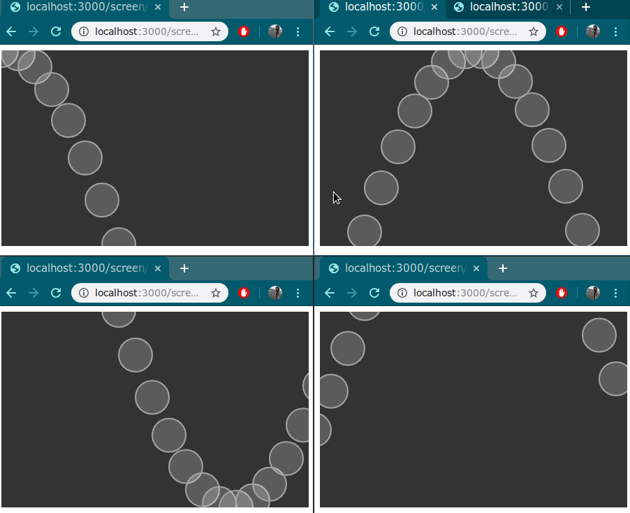

### Openmosaic Readme

Openmosaic is an experimental framework that allows you to run processing sketches across multiple screens. Openmosaic makes use of the fantastic [p5js](p5js.org) library and nodejs to make this happen.

