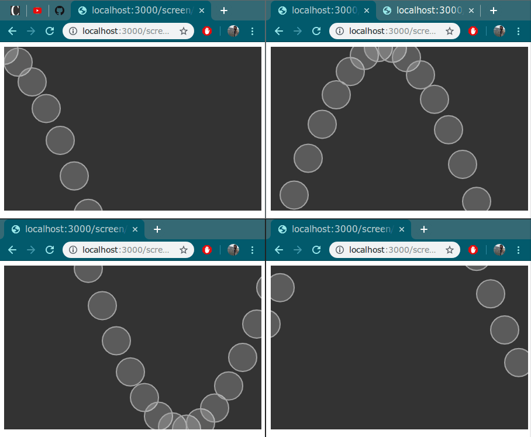

### Openmosaic Readme

Openmosaic is an experimental framework that allows you to run processing sketches across multiple browser clients. Openmosaic makes use of the fantastic [p5js](p5js.org) library and nodejs to make this happen.

### Example - ugly sine wave across 4 clients

1. Clone this repo - `git clone https://github.com/lonesword/openmosaic.git`
2. `cd` into the cloned directory
3. `npm install`
4. `node server.js -c config_example.json -s examples/wave_example.js`
5. Open 4 tabs in the browser and point them to the appropriate screen URLs (see [here](#to-write-your-own-sketch) )



### Usage
```
Usage: -c <config file> -s <sketch file>

Options:
  --help        Show help                                              [boolean]
  --version     Show version number                                    [boolean]
  -c, --config  Path to config file                          [string] [required]
  -s, --sketch  Path to sketch file                          [string] [required]
```
  
### To write your own sketch:

1. Your p5.js sketch _must_ call `mosaicInit();` from inside `setUp()`. Refer to any of the bundled examples.

2. Create a corresponding config.json file. Keys should be your screen names and each screen should specify an origin. Here is an example config:
```
{
	"my_screen_1": {
		"origin": [0, 0]
	},
	"my_screen_2": {
		"origin": [-440, 0]
	},
	"alice_screen": {
		"origin": [0, -280]
	},
	"bob_screen": {
		"origin": [-440, -280]
	}
}
```

This indicates that you wish the sketch to be run across 4 clients - `my_screen_1`, `my_screen_2`, `alice_screen` and `bob_screen`

3. Start the server by running `node server.js -c <config_file> -s <your_sketch_file>`

4. To load a screen, point the browser to `http://localhost:3000/screen/<screen_name>/`. For example, to view `alice_screen`, point your browser to `http://localhost:3000/screen/alice_screen/`.

5. Open a tab and go to`http://localhost:3000/start/` (or hit that URL from the terminal using CURL - it's a simple GET request) to "start" the sketch.

